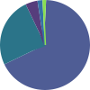

# kirby3-donuts
[](https://github.com/Fundevogel/kirby3-donuts/releases) [](https://github.com/Fundevogel/kirby3-donuts/blob/master/LICENSE) [](https://github.com/Fundevogel/kirby3-donuts/issues) [](https://travis-ci.org/fundevogel/kirby3-donuts)

A Kirby v3 plugin for creating SVG donut (and pie) charts.


## What
This library is a Kirby v3 wrapper for the PHP port [`tiny-phpeanuts`](https://github.com/Fundevogel/tiny-phpeanuts) of the TypeScript library [`tiny-donuts`](https://github.com/Verivox/tiny-donuts).


## How
Install this package with [Composer](https://getcomposer.org):

```text
composer require fundevogel/kirby3-donuts
```


### Usage
In order to generate a chart, we need some data first. The page method `toDonut()` accepts an array of data points as first argument - basically two or more arrays, each of which consists of `color` (string) and `value` (float):

```php
$data = [
    ['color' => '#4F5D95', 'value' => 0.6],
    ['color' => '#2b7489', 'value' => 0.4],
];

$page->doDonut($data);
```

There's also a field method `toDonut()` which takes `color` and `value` from a structure field. A basic example blueprint `fields/donut` (to be extended in your blueprint) looks like that:

```yaml
type: structure
fields:
  title:
    label:
      en: Title
      de: Titel
    type: text
    width: 1/2

  value:
    label:
      en: Value
      de: Wert
    type: number
    min: 0
    max: 1
    step: .01
    width: 1/4

  color:
    label:
      en: Color
      de: Farbe
    type: text
    width: 1/4
```

Both methods return a file object of the newly created SVG chart for further use.


#### Options
You may want to ..

- change the thickness of the chart
- the spacing between the segments
- add classes to the output SVG element
- make it a pie chart

.. here's how:

```php
$page->doDonut($data, $thickness, $spacing, $classes, $isPieChart);
```

| Parameter     | Type   | Default   | Description                  |
| ------------- | ------ | --------- | ---------------------------- |
| `$data`       | array  | -         | data to be visualized        |
| `$thickness`  | float  | see below | thickness of the chart       |
| `$spacing`    | float  | see below | spacing between the segments |
| `$classes`    | string | `''`      | classes applied to chart     |
| `$isPieChart` | bool   | `false`   | make it a pie chart          |

Attention: The field methods omits the `$data` argument (which is gathered from the structure field).


#### Configuration
You may also change certain options from your `config.php` globally (`'fundevogel.donuts.optionName'`):

| Option        | Type   | Default   | Description                |
| ------------- | ------ | --------- | -------------------------- |
| `'thickness'` | float  | `3`       | global default thickness   |
| `'spacing'`   | float  | `0.005`   | global default spacing     |
| `'size'`      | int    | `100`     | `viewBox` width & height   |
| `'inline'`    | bool   | `false`   | output inline SVG directly |
| `'template'`  | string | `'donut'` | chart file template        |


### Example
Adding some data points, it looks like this:


.. and with `$isPieChart` being `true`:




## Roadmap
- [ ] Add tests


## Credits
Naturally, a big shoutout goes to [Kim Almasan](https://github.com/Narquadah) & [Lars Krumbier](), who created `tiny-donuts` for [Verivox GmbH](https://github.com/Verivox). Most of the helper functions were taken from [Kirby](https://getkirby.com) by [Bastian Allgeier](https://github.com/bastianallgeier) (who's just awesome, btw).


**Happy coding!**


:copyright: Fundevogel Kinder- und Jugendbuchhandlung
